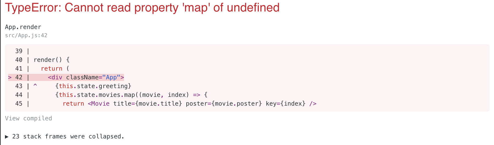

# Running React
프론트엔드를 못하니까 혼자서 할 수 있는게 많지 않다.<br>
프론트엔드 UI 프레임워크 제대로 배워보자.<br>
🌟나도 혼자 프로젝트 하고싶다.🌟

## Refs
- [리액트 기초 웹 서비스 만들기 React JS Fundamentals - 노마드 코더 Nomad Coders](https://www.youtube.com/playlist?list=PL7jH19IHhOLOFTVD4R8FeZWkwpVi8-9Fv)


## 101 내용은 나중에 정리

## Loading State
우리가 필요한 상태가 항상 처음부터 존재하지는 않는다.<br>
게시글 목록, 영화 목록 등은 서버로부터 API 호출을 통해 가져오는것이 일반적이기 때문이다.<br>
<br>
실제로 API를 작성하면 시간이 아까우니 `setTimeout()`을 활용해 마치 3초 후 API로부터 영화 목록을 받아오는듯한 멋진 Mock을 만들자.<br>
```js
import React, { Component } from 'react';
import Movie from './Movie'
import './App.css';

class App extends Component {

  state = {
    greeting: 'Hello!'
  }

  componentDidMount() {
    setTimeout(() => {
      this.setState({
        movies: [
          {
            title: 'Matrix',
            poster: 'https://images-na.ssl-images-amazon.com/images/I/51vpnbwFHrL._SY445_.jpg'
          },
          {
            title: 'Iron Man',
            poster: 'https://images-na.ssl-images-amazon.com/images/I/515wjJQt2nL._SY445_.jpg'
          },
          {
            title: 'The Avangers',
            poster: 'https://upload.wikimedia.org/wikipedia/ko/thumb/9/92/%EC%96%B4%EB%B2%A4%EC%A0%B8%EC%8A%A4_%EC%9D%B8%ED%94%BC%EB%8B%88%ED%8B%B0_%EC%9B%8C.jpg/250px-%EC%96%B4%EB%B2%A4%EC%A0%B8%EC%8A%A4_%EC%9D%B8%ED%94%BC%EB%8B%88%ED%8B%B0_%EC%9B%8C.jpg'
          },
          {
            title: 'Old Boy',
            poster: 'https://upload.wikimedia.org/wikipedia/en/thumb/6/67/Oldboykoreanposter.jpg/220px-Oldboykoreanposter.jpg'
          },
          {
            title: 'Star Wars',
            poster: 'https://i.amz.mshcdn.com/O8rMOJtTmcjAJSkJtdbJUAC100g=/950x534/filters:quality(90)/https%3A%2F%2Fblueprint-api-production.s3.amazonaws.com%2Fuploads%2Fcard%2Fimage%2F675031%2Fbbb3432c-5253-4fa8-bb03-35b4d1b9ce23.jpg'
          }
        ]
      })
    }, 3000)
  }

  render() {
    return (
      <div className="App">
        {this.state.greeting} <br/>
        {this.state.movies.map((movie, index) => {
          return <Movie title={movie.title} poster={movie.poster} key={index} />
        })}
      </div>
    );
  }
}

export default App;
```
`componentDidMount()`에서 3초 후 `movies` state를 변경하도록 해두었기 때문에 초기 렌더링 당시에는 `movies`라는 state가 존재하지 않는다.<br>
위 코드를 실행시키면 어떻게 될까?<br>

당연한 결과지만 `movies` state가 존재하지 않는데 map을 돌리려 했기 때문에 오류가 발생한다. 3초후에 생기고 말고는 알 바가 아니다. <br>
따라서 삼항연산자로 `movies` state가 존재하는지 먼저 검사해야한다.
```js
// 삼항연산자 안에서 렌더링해도 되지만 코드가 보기 어려워지니 함수로 분리한다.
_renderMovies() {
    return this.state.movies.map((movie, index) => {
      return <Movie title={movie.title} poster={movie.poster} key={index} />
    })
}

// render를 다음과 같이 수정한다.
render() {
    return (
      <div className="App">
        {this.state.greeting} <br/>
        {this.state.movies ? this._renderMovies() : 'loading! wait!'}
      </div>
    );
}
```
문제가 해결되었다. 앞으로는 영화 목록을 렌더링하기전에 **`movies` state가 존재하는지 검사 후 존재하지 않으면 'loading! wait!'을, 존재한다면 영화 리스트를 렌더링**할 것이다.<br>
<br>
참고로 AWS Console처럼 로딩중에 스피너가 삥글삥글 돌아가는 것도 Loading State로 구현할 수 있다. 와 쩔어!<br>
- [Loading State Trick for Stateless Functional Components in React](https://kyleshevlin.com/loading-state-trick-for-stateless-functional-components-in-react/)
- [React Loading Spinner Example](https://appdividend.com/2018/04/02/react-loading-spinner-example/)


